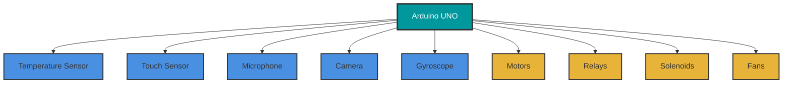

I've known the word "meditation" for a very long time, but it was really hard to understand what it actually *is*. Recently, since I've been reading *Metaphors We Live By*, I've realized that some complex things can be explained using other things, and it suddenly makes sense. In this reflection, I'll share how an IoT device might meditate—and this, in return, might teach us how to meditate, since we often understand technical things easier than deep philosophical concepts.

## The Arduino Setup

Let me paint a picture. Imagine we have an Arduino UNO board, and we connect several sensors to it:

- Temperature sensors
- Touch sensors
- A microphone
- A camera
- A gyroscope

Based on these sensor readings, we might need to trigger actions, so let's imagine we also have motors, relays, solenoids, and fans connected to the Arduino board.

Now, of course, if we're adding all this hardware, we want to *use* it. We program the Arduino so that when the temperature exceeds a threshold, a fan turns on. When the touch sensor is triggered, a motor activates. When the gyroscope detects movement, relays switch. We write code that fulfills our requirements—responding to sensor data with corresponding actions.



## When Things Don't Work: The Debug Mode

But imagine something isn't working correctly. How do we debug it?

If you're familiar with Arduino IDE, you know exactly what we do: we print the data to the Serial Monitor.
```cpp
void loop() {
  int touchValue = analogRead(TOUCH_PIN);
  Serial.println(touchValue);
  delay(100);
}
```

No if-statements. No actions. No motors turning on or off. Just observation—watching the values scroll by, one after another, without judgment, without reaction.

And that, my friend, is exactly what meditation is.

<div class="row">
    <div class="col-sm-6 mt-3 mt-md-0">
        
    </div>
</div>
<div class="caption">
    Prompt: A personified Arduino UNO board in meditation pose: the circuit board sits cross-legged (lotus position) with small robotic legs, its GPIO pins forming arms that rest gently on its knees in a classic meditation mudra. Thin sensor wires (temperature, touch, gyroscope sensors) connect to the board like neural pathways, gently glowing. A holographic Serial Monitor display floats in front showing scrolling sensor values in green monospace text. Peaceful ambient lighting, dark gradient background (navy to deep purple), subtle particle effects suggesting data flow. The overall mood: technology meeting mindfulness. Art style: modern 3D render with soft lighting, slightly whimsical but respectful.
</div>

## The Sensor Within

We have sensors in our body too. When we debug those sensors—when we notice their values without judging, without taking any action—this is meditation.

It's like listening to a sound and simply noticing it. Noticing how it changes, how it rises and falls, without labeling it as "good" or "bad," without reaching for the volume control.

Because of many conscious and subconscious programs running in our minds, we've forgotten to debug our sensors. We're always in action mode—constantly running if-statements, triggering responses, executing our programmed behaviors.

## The Analog Baseline

Here's something most people miss: even when a touch sensor in Arduino isn't touching anything, it still has an analog value. It's not zero. It's not silent. There's always a baseline signal.

I can feel that analog value using my fingers right now, without touching anything. I can monitor how it changes when I touch another object—perhaps my keyboard. The sensor was always active; I just wasn't listening to it.

This is what we miss in our daily lives. We only notice our "sensors" when they cross a dramatic threshold—pain, hunger, intense emotion. But in meditation, we tune into the baseline analog signal. That constant hum of sensation that's always there.

The slight pressure of your feet on the floor. The subtle movement of breath in your chest. The faint background sounds in your environment. The temperature of the air on your skin.

All of this data is streaming, constantly, like sensor values updating in real-time. Meditation is simply opening the Serial Monitor and watching.

## The Subconscious Firmware

Most of our code runs in interrupt handlers or background tasks we wrote long ago—learned behaviors, automatic reactions, patterns programmed by experience. When someone says something critical, our defensive subroutine executes automatically. When we feel uncomfortable, our distraction protocol kicks in.

Meditation is temporarily commenting out the action code. We don't delete it—it's still there, still useful—but for a moment, we just watch the data stream without letting it trigger the usual cascade of responses.

## Of Course, We Are Not Arduino Boards

I should be clear: this is a metaphor, not an equivalence. We are not circuit boards. Human consciousness is far more mysterious, nuanced, and profound than any embedded system.

But if you've ever stared at a Serial Monitor, watching sensor values scroll by—line after line of raw data, no actions taken, just pure observation—then you already know something about the meditative state.

You know what it feels like to be present with information without immediately reacting to it.

You know the calm focus that comes from simply watching what *is*.

## The Practice

Next time you sit down to meditate, imagine you're opening the Serial Monitor of your own consciousness. You're not there to fix anything, to change anything, to optimize anything.

You're just there to watch the values update:
```
breath_depth: 0.7
shoulder_tension: 0.3
ambient_sound: 0.5
thought_stream: "what should I have for dinner"
breath_depth: 0.8
foot_pressure: 0.4
...
```

No judgments. No actions. Just debugging your sensors, watching what's already happening.

That's all meditation is.

And sometimes, that's everything.
```

---

